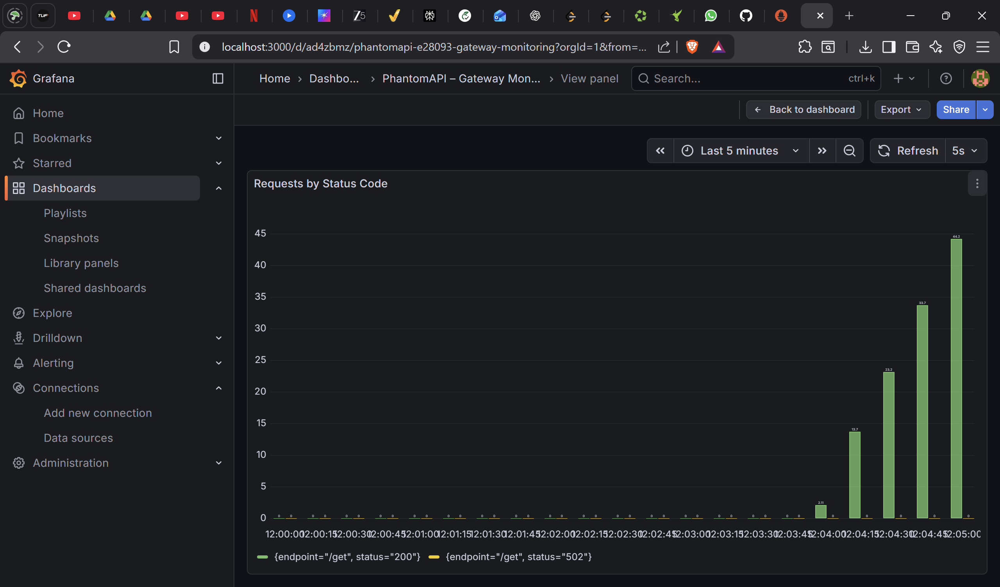

# PhantomAPI – Observable API Gateway

PhantomAPI is a FastAPI-based API Gateway with production-grade observability using Prometheus and Grafana.

## Features
- API Gateway built with FastAPI
- Request proxying with latency measurement
- Prometheus metrics for request count & latency
- Real-time Grafana dashboards
- Endpoint-level monitoring

## Architecture
Client → FastAPI Gateway → Upstream API  
                      ↳ Prometheus → Grafana

## Metrics Exposed
- `api_requests_total`
- `api_request_latency_ms_bucket`
- `api_request_latency_ms`

## Dashboard


## Tech Stack
- FastAPI
- Prometheus
- Grafana
- Python
- HTTPX

## How to Run
```bash
uvicorn gateway:app --reload --port 8001
